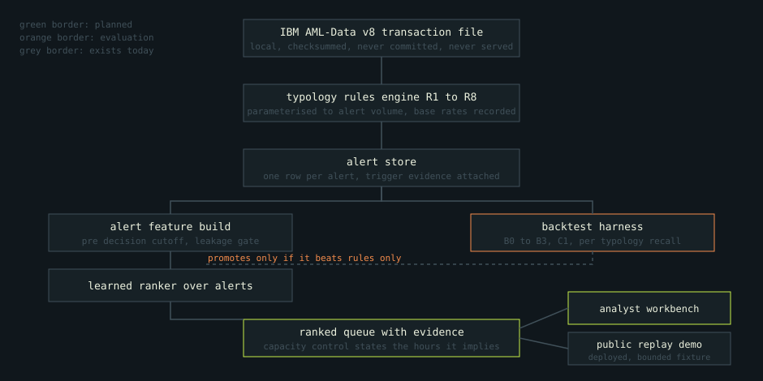

# Signal Ledger

[](https://signal-ledger-workbench.vercel.app)
[](docs/data-dictionary.md)
[](docs/scope.md)

> A read-only evidence replay for reviewing synthetic banking cases without live
> scoring, server-side visitor storage, or automated compliance decisions.

## What it does

Signal Ledger's portfolio product is the approved public replay: six bounded
cases containing 55 selected and pseudonymized transactions from realistic
synthetic IBM AML-Data v8. A reviewer can select a case, replay its sequence,
inspect counterparties and evidence, and record a simulated rationale that stays
inside the browser.

- **Public:** the six-case replay, one approved review period of the triage
  queue, their provenance, and browser-private simulated records.
- **Local only:** raw source data, the alert store, the feature table, tuned rule
  parameters, model execution, the LI-Small variant, and every review period
  other than the approved one.
- **Never performed:** request-time inference, alert suppression, report filing,
  customer action, or a compliance recommendation.

The wider research pipeline is complete and measured. It generates an alert
population from eight written typology rules, evaluates a baseline ladder, and
tests a learned ranker. That work is supporting evidence, and one review period
of it is now a deployed surface: the owner recorded a distribution decision for
the triage slice, so the triage desk serves alongside the replay under
CDLA-Sharing-1.0 with its modification and pseudonymisation notice. See
[decision 0009](docs/decisions/0009-the-triage-surface-is-local-until-it-is-approved.md)
for why it was withheld and
[decision 0012](docs/decisions/0012-the-triage-slice-is-approved-and-pinned.md)
for what the approval covers and what it does not.

**No model ships.** Across seven evaluation periods at 126 alerts worked per
period, the learned ranker finds 148 true positives in the 882 worked alerts
against 120 for sorting by alert amount and 102 for rules only priority. It beats
every rung, and its lift over the strongest rung is 1.23 against a gate of 1.3
that was written before the model existed, so it is not promoted. A measured
negative closes the milestone rather than failing it.

**The negative holds on a second variant.** The pipeline was rerun on the low
prevalence LI-Small release with nothing changed. The ranker again beats every
rung, again misses the gate at a lift of 1.28, and here also fails the per
typology floor that held on HI-Small.

Every interval, structural zero, and denominator is in [the case
study](docs/CASE_STUDY.md).

## Live demo

[signal-ledger-workbench.vercel.app](https://signal-ledger-workbench.vercel.app)

Open a case from the queue, step through its timeline, and inspect the bounded
topology. The provenance panel identifies the approved artifact being served.
A simulated escalation or closure note stays in browser storage and is never
sent to the API.

The demo serves one bounded six case, 55 transaction fixture. It has no
authentication, no telemetry, no server side visitor storage, no request time
inference and no write API.

The live URL serves both surfaces. The triage queue carries one review period of
749 alerts, whole, with the capacity control, the cut line drawn inside the queue,
the ordering switch across every rung and the challenger, and both the structural
zero and baseline wins states. The public service admits only the pinned release
of that artifact and refuses any other build with a 503. Running the desk against
a local rebuild takes `APP_MODE=local-triage-workbench`; the runbook is
[docs/WORKBENCH_VERIFICATION.md](docs/WORKBENCH_VERIFICATION.md).

The approval covers this one review period of the HI-Small variant and nothing
else. The alert store, the feature table, the LI-Small run and the tuned rule
parameter values stay local.

## Architecture



A local, checksum verified IBM AML-Data v8 transaction file feeds a typology
rules engine, which emits an alert store. Alerts, not transactions, are the unit
of everything downstream: features are built per alert with a strict pre decision
cutoff, a learned ranker orders them, and a backtest harness measures the
ordering against the rules only baseline. The ranked queue serves the analyst
workbench, as a precomputed artifact rather than as a request time score.

The grey boxes exist today, including the ranker, and the orange backtest harness
is built and measured. The ranker is measured and not promoted. The ranked queue
and the analyst workbench are on the public surface, serving one approved review
period; everything upstream of the artifact stays local. The deep version is in
[docs/architecture.md](docs/architecture.md).

## Data

IBM AML-Data v8, published by IBM and Erik Altman under the Community Data
License Agreement, Sharing, Version 1.0. One row per transaction: timestamp,
banks, accounts, amounts, currencies, payment format, and a simulator generated
laundering flag.

It is **realistic synthetic banking data**, not anonymised customer data. Two
variants are verified and used locally: HI-Small at roughly five million
transactions, which is the evaluation variant and the one the public fixture is
drawn from, and LI-Small at roughly seven million, which is used for the
prevalence sensitivity run and never reaches a public surface.

Raw files are never tracked and never served. The only committed data is the
bounded public fixture, reproduced deterministically from a verified source
manifest and an approved distribution decision. The load step and every field are
documented in [docs/data-dictionary.md](docs/data-dictionary.md).

## Evaluation

The baseline is rules only, because that is what institutions actually run. Each
rung has to be beaten before the next candidate is justified.

**The ladder, measured on HI-Small.** Seven evaluation periods from an expanding
walk forward, 126 alerts worked per period, 882 worked alerts against a
population of 5,715 alerts carrying 223 true positives.

| Rung | True positives | Precision at K | 95 percent interval |
| --- | --- | --- | --- |
| B0 random | 41 | 4.65 percent | 3.40 to 6.01 |
| B1 chronological, oldest first | 100 | 11.34 percent | 9.30 to 13.49 |
| B2 alert amount descending | 120 | 13.61 percent | 11.45 to 15.99 |
| B3 rules only priority | 102 | 11.56 percent | 9.30 to 13.61 |
| C1 learned ranker | 148 | 16.78 percent | 14.51 to 19.16 |

B3 over B2 is 0.85 with a paired interval of 0.75 to 0.96, so the single feature
sort beats rules only priority by more than the noise. The rung a ranker has to
beat is B2.

| Metric | Baseline | Threshold | Result | What it means |
| --- | --- | --- | --- | --- |
| False positive reduction at held coverage | strongest rung, B2 | 20 percent | **46.26 percent** | Holding B2's coverage costs the ranker 46 percent less worked volume. Coverage is counted in true positive alerts, because 25 surfaced attempts cannot carry the attempt count |
| Precision at K | B2 at 13.61 percent | 1.3 times the baseline | **1.2333, interval 1.10 to 1.40. MISSED** | Real improvement, short of the gate. This is why no model ships |
| Per typology recall, R1 to R8 | B3 at the same K | no supported typology more than 5 points below | **0.0 points, held** | C1 is at or above B3 everywhere and recovers in four typologies against B3's one |
| Rank stability across periods | not applicable | Spearman 0.70 | **0.9141 over six pairs** | The queue would not reshuffle on retrain |
| Rules and model contribution split | rules only at 11.56 percent | informational | **plus 5.22 precision points** | Rules only accounts for 102 of C1's 148 true positives; the learned score adds 46 |

**The ranker beats every rung and is not promoted.** The gate was set before the
model existed and the model came in at 1.23 rather than 1.3. Reporting the 1.45
lift against rules only priority instead would clear it, and would be a
comparison against a rung that is itself beaten by sorting on amount. A measured
negative closes the milestone rather than failing it.

**Where the alerts actually go.** The deployed desk carries the measured run
broken back into the units the work happens in, at `/api/triage/evidence`: 337
attempts live, 25 surfaced by the rules, 8 reached at capacity by the ranker. 198
of the 223 flagged alerts carry no typology at all and 139 of the ranker's 148
true positives sit on that line. Alert volume swings 304 to 2,127 across the seven
periods, so a fixed team covers 41.4 percent of the lightest period and 5.9
percent of the heaviest. The volume reduction is reported per period with its
signs kept, because the attempt based measure goes negative in two of seven.
See [decision 0013](docs/decisions/0013-show-where-the-alerts-go.md).

**The finding that constrains all of it.** The rules engine, parameterised to a
workable daily alert volume and never to the laundering flag, surfaces 25 of the
337 injected laundering attempts live in the evaluation periods. No injected
attempt presents the counterparty count the fan in and fan out rules require
inside a single day; the attempts spread their structure across several days. Per
typology recall at K is therefore between zero and eight attempts for every
ordering including the ranker, and ordering cannot recover an attempt no rule
raised. Precision at K is carried almost entirely by flagged transactions the
patterns file does not attribute to any typology, 198 of the 223 true positive
alerts, which is reported as its own line rather than folded into a typology. The
largest available gain in this project is a better alert population, not a better
ranker.

**The same result on the low prevalence variant.** The whole pipeline was rerun
on LI-Small with the parameter set, the operating point and every metric
definition held fixed. In the study window LI-Small carries a transaction level
laundering rate of 0.05602 percent against HI-Small's 0.10061 percent, which is
0.56 of it, and an alert population base rate of 3.10 percent against 3.90
percent.

| Rung | True positives | Precision at K | 95 percent interval |
| --- | --- | --- | --- |
| B0 random | 33 | 3.74 percent | 2.49 to 4.99 |
| B1 chronological, oldest first | 101 | 11.45 percent | 9.41 to 13.49 |
| B2 alert amount descending | 110 | 12.47 percent | 10.43 to 14.63 |
| B3 rules only priority | 97 | 11.00 percent | 8.96 to 13.15 |
| C1 learned ranker | 141 | 15.99 percent | 13.61 to 18.48 |

B2 is the strongest rung again, so the reference the gate is measured against is
not dataset specific. C1's lift over B2 is **1.2818 with an interval of 1.20 to
1.38 against the same gate of 1.3, missed again**. False positive reduction at
held coverage is 51.47 percent and rank stability averages 0.9222, both passing.
The per typology floor **fails here at 8.33 points below B3 against a permitted
5**: C1 recovers no attempt in any typology, where B3 recovers one CYCLE and one
SCATTER-GATHER. On LI-Small C1 misses two of the three ship criteria rather than
one.

Two caveats are recorded rather than smoothed over. The perturbation attenuates:
a 44 percent cut in transaction level prevalence becomes a 21 percent cut in the
alert population base rate, because the rules select for structure and structure
survives the variant. And K stays at 126 because K is analyst hours, so the same
parameters produce a deeper queue on LI-Small and C1 works 11.8 percent of a mean
period against 15.4 percent on HI-Small. The run varies prevalence and queue
depth together. The rules engine surfaces 7.41 percent of live attempts here
against 7.42 percent on HI-Small, which is the one number that does not move at
all. See
[decision 0008](docs/decisions/0008-the-negative-survives-lower-prevalence.md).

## Local research appendix

The triage surface is deployed against one approved review period. It answers one
question: at the capacity available, what does the review team reach and what does
it give up? The slice it serves is approved for that period alone; every other
period, the alert store and the tuned parameters stay local.

- **The capacity control is the product.** It is expressed in analyst hours, with
  the alert count derived from it and both restated on every move: alerts
  included as a count and a share, hours implied at a stated and adjustable
  handling time, true positives reached, what is not reached, per typology
  attempts recovered with their live and surfaced counts, and which typology
  loses coverage first as capacity falls.
- **The cut line is drawn inside the queue.** Every alert below it stays visible,
  keeps its disposition control, and opens to the same detail view. The copy is
  "not reached at this capacity", never excluded, cleared, or low risk. The model
  reorders and never suppresses, and the interface has to show that or the claim
  is only in a document.
- **Baselines switch in place.** The queue reorders to any rung B0 to B3 or to the
  challenger and restates the same numbers, so the project's central comparison is
  read in the analyst's own unit rather than on a results page.
- **Rank carries no colour.** No bar, no heat scale, no gradient. A colour scale
  invites rank to be read as a probability or a severity and it is neither.
- **Both honest states render at full weight.** "The baseline holds. No model
  ships" sits above the queue in the largest type on the surface, with the lift,
  its interval and the gate beside it. The five rules the simulator generates no
  counterpart for carry a structural zero with their reason and their measured
  alert volume on the same row.
- **The disposition control carries no default** and there is no recommended
  action anywhere. A disposition and its rationale stay in the browser.
- **The alert detail explains itself down to the transaction**, with each fired
  rule's computed trigger quantities, the model's own per feature contributions,
  and the parameter set described by name, unit and direction of effect. The tuned
  values are not published, because a precise trigger set published openly reads
  as an evasion guide.

Everything on that local surface is precomputed. Nothing is scored at request
time, the browser does arithmetic over a fixed table, and the admission check
imports nothing from the pipeline. Public mode rejects the artifact before any
row can be served.

Definitions, method, splits and confidence intervals are in
[docs/metric-glossary.md](docs/metric-glossary.md).

## Limits

- The laundering flag is generated by a simulator. Every measurement is a
  statement about a simulated population, never about real world detection.
- The simulator only produces the typologies its authors implemented. A rule
  targeting a pattern it never generates shows a structural zero, which is a
  property of the data rather than a model result.
- No compliance suitability, regulatory acceptance, or production readiness is
  claimed. This is not a Bank Secrecy Act compliant system.
- No automated adverse action of any kind. Nothing here closes an alert, files a
  report, or touches a customer.
- The source carries no analyst disposition history, no suspicious activity
  report outcome and no know your customer data, so anything a production system
  would learn from investigator feedback has to be constructed here.
- Typology rules are described, but their exact tuned trigger thresholds are not
  published, because a precise trigger set reads as an evasion guide.
- The deployed workbench predates this product direction. It replays a fixture;
  it does not triage.
- Per typology recall is directional at best here. The rules surface 25 of 337
  live attempts, so every typology figure rests on a handful of attempts and is
  printed with its attempt count and its interval.

## Scaling

The demo topology does no work per request. A static React build plus one FastAPI
function serving a precomputed bounded artifact scales with the provider's edge
cache, which is why it can sit permanently on a free tier.

The first component that breaks at volume is the rules engine, which holds
counterparty windows in memory. Past the Small dataset variants it moves to
partitioned columnar storage and out of core processing, run once for evidence
and torn down inside a recorded cost ceiling. Choosing a Large variant would make
this a data engineering project as much as a data science one, which is a trade
recorded rather than taken quietly.

The serving path does not change at any scale. Putting inference behind a public
URL is a claims decision, not a capacity one, and the answer is no.

## Quick start

```sh
pip install -r requirements-dev.txt
uvicorn src.app:app --reload
# in a second shell
cd frontend && npm ci && npm run dev
```

Verify:

```sh
python3 -m pytest -q
ruff check .
python3 scripts/verify_release.py
cd frontend && npm ci && npm run build
```

A production-like local check:

```sh
docker compose -f docker/docker-compose.yml up --build
curl -fsS http://127.0.0.1:8000/api/readiness
```

## Decisions

Every significant choice, with its rejected alternatives, is recorded in
[docs/decisions/](docs/decisions/). The reason this project ranks alerts rather
than detecting laundering, and the measured negative result that preceded it, are
in [0002](docs/decisions/0002-repoint-to-alert-triage.md).

## License

Source code and documentation are available under the [MIT License](LICENSE).
The bounded public replay fixture is derived from IBM AML-Data v8 and remains
under [CDLA Sharing 1.0](DATA_LICENSE.md).
