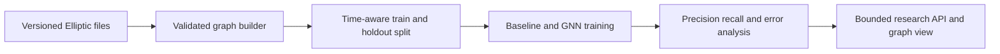

# Financial AML Graph Detection

Status: **building**. This is a pending research project, not a deployed compliance product and not evidence that any real entity is illicit.

The intended workflow turns the public Elliptic Bitcoin transaction graph into a reproducible graph-learning benchmark: construct the graph, train an explainable baseline and GraphSAGE/GAT candidate, evaluate the minority illicit class, then expose only a bounded research scoring interface.

## Data boundary

- Source: Elliptic transaction graph, obtained under its published access terms.
- Classification: public research data.
- Excluded: customer, bank, account, KYC, and confidential compliance data.
- Record the exact source, license/access terms, checksum, and permitted use before adding data.

## Planned architecture

## Current gate

The draft contract is structurally valid, but first-demo readiness is blocked on reproducible data provenance, implemented graph construction, versioned evaluation, safe examples, tests/CI evidence, and deployment evidence. See `docs/STATE.md`, `docs/HANDOFF.md`, and `portfolio/project.json`.

No metric, demo URL, production claim, or compliance outcome should be added before that evidence exists.
