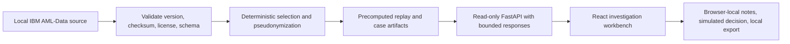

# Signal Ledger delivery plan

## Delivery contract

**Current milestone:** H — Render deployment readiness (next)

Signal Ledger will be a deployable public research workbench for a deterministic,
synthetic banking-event replay. A visitor can replay a bounded case, inspect its
timeline, topology, evidence, and uncertainty, then create a browser-private,
simulated audit artifact. The product is not a live monitoring system, a
compliance product, or a conclusion about a person or entity.

### Goals

- Make analyst review tangible: case queue, replayable timeline, bounded topology,
  evidence, uncertainty, and a clearly human simulated disposition.
- Demonstrate reproducible data engineering: validated local source ingestion,
  deterministic case selection, precomputed replay artifacts, and visible lineage.
- Provide a polished, accessible React + TypeScript and FastAPI experience that
  is ready to be deployed to Render after owner approval.
- Keep the public surface safe: approved realistic synthetic banking data only;
  no request-time model training or inference.

### Non-goals

- Real transaction monitoring, real-person/entity allegations, compliance advice,
  or automated decision recommendations.
- Live blockchain/financial telemetry, paid data/services, or visitor-submitted
  server-side data.
- Authentication, multi-user collaboration, or server-side decision persistence.
- Public Elliptic data, derived graphs, model outputs, or metrics.
- Deployment, publication, push, merge, or release without explicit owner approval.

## Users and jobs

| User | Job to be done | Evidence of success |
| --- | --- | --- |
| AML analytics leader | Assess whether the workflow respects analyst capacity, evidence, uncertainty, and human review. | Can trace one case from queue through replay, evidence, and a simulated disposition. |
| ML hiring manager | Evaluate end-to-end engineering judgment beyond a model demo. | Can inspect deterministic data lineage, bounded APIs, reproducibility, evaluation boundaries, and delivery hardening. |
| Risk/compliance recruiter | Understand the project’s safety and governance posture quickly. | Sees synthetic-data labeling, limitations, audit semantics, and no-production-claim boundary in the product and docs. |

## Proposed architecture

- The full IBM input is processed offline/local by default. Public deployment
  serves only legally approved, bounded synthetic artifacts.
- The API is read-only and returns precomputed data. Browser actions never train,
  score, or call a model.
- Browser-local storage may retain a visitor’s simulated rationale/decision and
  a local export. The server stores neither visitor input nor identities.
- The local Elliptic research boundary remains separate and cannot be queried,
  serialized, or displayed by the public product.

## Data, legal, and owner gates

| Gate | Required evidence | Owner decision |
| --- | --- | --- |
| IBM public artifact | Exact source/version, retrieval date, source and output SHA-256, attribution, CDLA-Sharing-1.0 text/link, schema, and deterministic selection manifest. | Approve any public artifact only after distribution obligations are recorded. |
| Elliptic isolation | Local-only path, documented source/access terms/checksum, exclusion tests, and no public rows/graphs/models/metrics. | Separate written permission is required before any public use. |
| Claims | Versioned evidence for every evaluation or operational assertion. | Approve any aggregate research statement before publication. |
| External services | No telemetry or paid resource in v1. | Explicit approval is required before adding either. |
| Deployment | Render readiness evidence and approved account/project. | Explicit owner approval is required before creating a deployment. |

## Milestones and acceptance criteria

### A — Product discovery and delivery plan

- [x] Record product goals, non-goals, users, architecture, risks, gates, and
  owner decisions.
- [x] Define a single public mode: anonymous, read-only, synthetic replay;
  browser-private simulated notes/decisions with local export.
- [x] Define milestones B–I with acceptance and verification requirements.
- [x] Update authoritative handoff/state and record verification results.
- [x] Commit intentional documentation using the configured human identity.

**Complete when:** this plan, `docs/STATE.md`, and `docs/HANDOFF.md` agree on the
current milestone, deployment remains owner-gated, verification passes, and the
documentation commit exists.

**Verification:** `git diff --check`; documentation consistency searches;
`git status --short`; refreshed Graphify report; Ponytail audit outcome.

### B — Data provenance and deterministic fixture/replay pipeline

- [x] Validate the IBM input checksum, schema, exact version, retrieval record,
  attribution, and CDLA-Sharing-1.0 access/distribution obligations.
- [x] Create a deterministic selection manifest and generator that records
  inputs, selection rules, pseudonymization, output checksum, and pipeline run ID.
- [x] Materialize bounded public replay/case artifacts offline; no request-time
  inference or full-dataset browser delivery.
- [x] Add provenance, determinism, and public-boundary tests.

**Complete when:** rerunning against the verified local input produces the
recorded artifact/hash, the public-output decision is documented, and no
unapproved data can enter the public path.

**Verification:** generator reproduction command; checksum comparison; schema and
selection tests; source/output boundary scan; `git diff --check`.

**B completion record (2026-07-24):** the official v8 input was retrieved,
schema-validated, and matched SHA-256
`b19d39f515523373f991b689c07e11e7b0b95c17a2c27a87d91584ae16c5b040`. The owner
approved publication for that exact source checksum under CDLA-Sharing-1.0.
Two local builds were byte-identical (file SHA-256
`79ab2c9350cedd3eac394e13e0c67bd595cfbc3e2e4cca137cd46e75d69c9409`), with
artifact hash `62b1d7476466f5456f61ef0d019db52536cf13e46e584724d5346a9ad8b75db2`
and pipeline run ID `d7bd5a14342256427d08604a6e7ce9d3f2ce60ff5e3b154298fffd8db6a31356`.
The source and temporary outputs were removed after verification; only the
bounded, pseudonymized artifact is committed.

### C — API contract, validation, and data-boundary tests

- [x] Define typed contracts for health/readiness, replay catalogue/detail,
  timeline, bounded topology, evidence, provenance, and methodology.
- [x] Validate all path/query parameters; enforce response limits and stable
  secure error messages.
- [x] Make API access read-only, prevent Elliptic/local-source routes, and test
  that visitor input cannot be persisted or trigger inference.

**Complete when:** contract and negative tests cover valid, invalid, boundary,
and forbidden access paths; API behavior matches public data governance.

**Verification:** FastAPI tests, schema/contract tests, public-route allowlist
test, forbidden-route tests, and static search for local data paths.

**C completion record (2026-07-24):** `src/contracts.py` defines strict public
response models for health, readiness, catalogue, detail, timeline, bounded
topology, evidence, provenance, and methodology. The API exposes a fixed
GET-only allowlist, disables unauthenticated documentation endpoints, validates
case IDs, rails, timeline limits (1–18), and topology depth (1–2), and returns
the stable `{"detail": "Invalid request parameters."}` body for malformed
requests. The only new public data surface is bounded, precomputed synthetic
replay evidence; it does not accept visitor input or perform inference.

**C verification record (2026-07-24):** `uv run pytest -q` passed (6 tests);
`uv tool run ruff format --check src/app.py src/contracts.py tests/test_app.py`,
`uv tool run ruff check src tests`, `uv run python -m compileall -q src tests`,
and `git diff --check` passed. Tests cover valid, invalid, and boundary
parameters; fixed route allowlist; unavailable Elliptic/local-source paths;
disabled docs/OpenAPI paths; and 405 rejection of visitor-input POST bodies.
Static boundary search found only the explicit local-only methodology statement,
the provenance filename contract, and the negative tests. No UI work,
deployment, publication, push, merge, or external access occurred.
Graphify was refreshed code-only and reclustered at implementation commit
`7ed3cef7`; documentation semantic extraction remains unavailable without an
LLM backend, and the installed package/skill version warning is non-blocking.

### D — Useful investigation UX redesign

- [x] Build the replay workbench: searchable/filterable case queue, replay
  controls, time-filtered timeline, bounded interactive topology, evidence,
  uncertainty, provenance, and recovery states.
- [x] Preserve one concrete flow: select case → replay/inspect → understand
  evidence/limits → proceed to simulated human record.
- [x] Support keyboard use, semantic labels, focus visibility, reduced motion,
  responsive layout, and loading/empty/error states.

**Complete when:** the defined workflow works at desktop and mobile widths, every
screen supports a concrete analyst action, and no UI presents a score as a decision.

**Verification:** Impeccable context/review and detector; rendered browser
inspection; keyboard, responsive, loading/empty/error checks; frontend lint/build.

**D completion record (2026-07-24):** rebuilt the existing Signal Ledger
operate-mode workbench without changing its public-data contract. The new
surface provides a searchable guided case queue, rail filter, play/pause/reset
timeline replay, bounded keyboard-operable topology, evidence/uncertainty,
provenance, loading/empty/error recovery, responsive layout, and a visible
handoff to—rather than an implementation of—the next browser-local simulated
record workflow. It remains explicitly a deterministic realistic synthetic
banking-data replay, with no score-as-decision language, no writes, and no
request-time inference.

**D verification record (2026-07-24):** `node .../impeccable/scripts/detect.mjs
--json frontend/src/main.tsx frontend/src/styles.css` returned `[]`; `npm run
lint`, `npm run build`, `uv run pytest -q` (6 passed), and `git diff --check`
passed. Local rendered inspection verified desktop and 390px mobile layouts,
case selection, replay progression, filter empty state, keyboard topology
selection, and no browser console warnings/errors. No deployment, publication,
push, merge, external access, visitor persistence, or UI work from Milestone E
occurred.
Graphify was refreshed code-only and reclustered at implementation commit
`09e50125`; documentation semantic extraction remains unavailable without an
LLM backend, and the installed package/skill version warning is non-blocking.

### E — Analyst decision and audit workflow

- [x] Add browser-private rationale, simulated escalation/closure, local history,
  reset, and JSON export containing fixture/version, visible evidence, action,
  rationale, and timestamp.
- [x] Include a seeded, read-only example history so visitors can understand the
  audit shape before writing anything.
- [x] State clearly that decisions are simulated, local to the browser, and not
  compliance actions or server records.

**Complete when:** refresh/reset/export behavior is understandable, accessible,
and cannot send visitor notes to the API.

**Verification:** frontend behavior tests; browser storage/export/reset checks;
network inspection confirming no write requests; accessibility checks.

**E completion record (2026-07-24):** added browser-private simulated audit
records with optional rationale, simulated escalation/closure, local history,
clear reset, and JSON export. Every export records the fixture dataset version
and replay checksum, visible evidence statements, selected simulated action,
rationale, and timestamp. A seeded read-only example explains the audit shape;
visitor-created records are isolated under one browser-local key and are never
sent to the API. The UI explicitly says this is a local simulated exercise, not
a server record, training/inference event, or compliance action.

**E verification record (2026-07-24):** Impeccable detector returned `[]` and
independent finish review found no material issue. `npm run lint`, `npm run
build`, `uv run pytest -q` (6 passed), and `git diff --check` passed. Browser
inspection verified rationale entry, simulated decision, refresh persistence,
local export confirmation, reset back to the read-only example, keyboard
controls, and zero browser-console warnings/errors. The in-app browser did not
expose a download event, but the export confirmation and client-side Blob flow
were verified. Static source inspection confirms the sole `fetch` has no write
method and all visitor state uses localStorage only. No deployment,
publication, push, merge, external access, or work from F occurred.
Graphify was refreshed code-only and reclustered at implementation commit
`21427a4c`; documentation semantic extraction remains unavailable without an
LLM backend, and the installed package/skill version warning is non-blocking.

### F — Evaluation and reproducibility boundary

- [x] Version a local-only evaluation procedure for Elliptic research with source
  gate, chronological split, explicit unknown-label treatment, baseline/GNN
  comparison, PR-AUC, precision/recall, calibration, review capacity, and
  operational-error analysis.
- [x] Separate research evidence from public replay artifacts and prevent public
  metrics until independently verified and owner-approved.

**Complete when:** the procedure is reproducible with versioned evidence and the
claims/publication boundary is mechanically documented and tested.

**Verification:** evaluation command and manifest validation; report schema
checks; boundary tests; review of class-imbalance/operational-error reporting.

**F completion record (2026-07-24):** added
`docs/ELLIPTIC_EVALUATION_PROTOCOL.md`, a versioned `local-only` manifest/report
contract, and `scripts/validate_local_evaluation.py`. The protocol requires
source access terms, checksum, retrieval record, chronological split, explicit
unknown-label treatment, a versioned baseline/GNN comparison, and aggregate
PR-AUC, precision, recall, calibration, review-capacity, and operational-error
analysis. It is a procedure only: no Elliptic input, graph, model, prediction,
metric, or effectiveness claim was produced.

**F verification record (2026-07-24):** `uv run pytest -q` passed (12 tests),
including public-path, publication-status, chronological-split, raw-identifier,
and incomplete-metric rejection. Ruff format/check, compileall, and `git diff
--check` passed. The validator rejects public delivery paths and unapproved
reports; the public API retains its fixed route allowlist and does not import
this local research contract. No deployment, publication, push, merge, external
access, or work from G occurred.
Graphify was refreshed code-only and reclustered at implementation commit
`420f82e7`; documentation semantic extraction remains unavailable without an
LLM backend, and the installed package/skill version warning is non-blocking.

### G — Browser E2E, accessibility, responsive, and Docker verification

- [x] Add repeatable browser E2E for replay, filters, topology, decision/export,
  error recovery, and public data boundary.
- [x] Verify keyboard navigation, accessible names, contrast/focus, reduced
  motion, mobile/tablet/desktop layouts, API tests, production build, and Docker.

**Complete when:** all automated checks pass and browser inspection confirms the
critical journey without console errors.

**Verification:** E2E/accessibility/responsive commands; API suite; frontend
lint/build; Docker build/run/health; compose config; `git diff --check`.

**G completion record (2026-07-24):** the committed read-only
browser journey and its public-boundary test are in
`scripts/verify_workbench_browser.sh` and `tests/test_workbench_boundary.py`.
The API suite (14 passed), Ruff check and formatting check for the new G file,
compilation, frontend lint/build,
Compose configuration, diff check, and local desktop-browser inspection passed.
The inspection found labelled inputs, keyboard-operable topology nodes,
focus/reduced-motion support, no error overlay, and no console warnings/errors.
The repeatable `agent-browser` CLI journey passed, including the local simulated
rationale/action/reset flow and interactive controls. Docker Compose built the
production image, started the service, and `/api/health` returned the expected
read-only, no-inference public response; the temporary container and network
were removed afterward. No deployment, publication, or external access occurred.

### H — Render deployment readiness

- [ ] Pin reproducible dependencies/build commands and add CI coverage.
- [ ] Add Docker health/readiness checks, environment validation, production CORS
  allowlist, secure error handling, runtime documentation, and rollback runbook.
- [ ] Produce an owner-ready Render checklist without deploying.

**Complete when:** the container is reproducibly buildable, externally configurable
without secrets in source, and deployment/rollback instructions are tested locally.

**Verification:** clean dependency install/build, CI equivalent, Docker health
probe, configuration validation, production CORS tests, and deployment-doc review.

### I — Owner-approved live deployment and post-deploy verification

- [ ] Obtain explicit approval for the Render account/project and production
  deployment.
- [ ] Deploy only the approved public synthetic artifact and record the release.
- [ ] Verify public health, CORS, synthetic labels, no write routes, no local-only
  exposure, and rollback procedure.

**Complete when:** the owner-approved URL, release identifier, health result,
rollback path, and post-deploy checks are recorded.

**Verification:** owner-approved deploy command, deployed health check, smoke/E2E
test, headers/CORS review, data-boundary probe, and rollback dry-run or procedure.

## Risks and dependencies

| Risk/dependency | Control |
| --- | --- |
| IBM redistribution obligations are misunderstood. | Treat public artifact publication as blocked until terms and derivative-output decision are recorded. |
| “Live” presentation is mistaken for real monitoring. | Use “deterministic synthetic replay” wording in UI, API, docs, and deployment copy. |
| A large dataset leaks through API or build artifacts. | Offline materialization, explicit allowlist, response limits, Docker copy boundary, and negative tests. |
| Browser-local audit state is mistaken for durable case management. | Prominent local-only/reset/export language and seeded read-only example history. |
| UI scope turns into a generic dashboard. | Use the select → replay → inspect → record flow as the acceptance test for every surface. |
| Render configuration weakens the public boundary. | Readiness, CORS, health, environment, and deployed-boundary gates before owner approval. |

## Mandatory milestone handoff

Every completed milestone must update this document, `docs/STATE.md`, and
`docs/HANDOFF.md` with:

1. completed work and commit SHA(s);
2. exact verification commands and observed results;
3. remaining work and current blockers;
4. data, access, and deployment status;
5. Graphify status and source-commit freshness;
6. the exact next milestone.

No milestone advances on intended work alone. If context becomes constrained,
finish the current milestone handoff before stopping.

## Milestone A audit record

- **Graphify:** refreshed with `graphify update .`; the report is built from
  `925931e2`, the current source commit at audit time. The tool warned that the
  installed package (`0.9.25`) is newer than the bundled skill (`0.9.23`) and
  that JSON files have no structural nodes; neither warning blocks this milestone.
- **Ponytail audit:** no documentation-scope code simplification was applied.
  Stale graph-oriented CSS is a plausible deletion candidate, but it belongs to
  the visual redesign and requires rendered-browser verification in Milestone D.
  Dependency pinning and Docker install reproducibility belong to Milestone H.
- **Safe simplification decision:** preserve the existing implementation during
  documentation-only Milestone A; no unrelated code or UI changes are mixed into
  this commit.

## Milestone A handoff — 2026-07-24

- **Completed work:** created this delivery plan; established the anonymous,
  read-only replay product boundary; defined milestones B–I, acceptance criteria,
  risks, owner/data gates, and handoff requirements; synchronized
  `docs/STATE.md` and `docs/HANDOFF.md`.
- **Commit:** `docs: add Signal Ledger delivery plan` (configured human identity;
  SHA recorded in Git history).
- **Verification:**
  - `graphify update .` — passed; report refreshed from `925931e2`, matching the
    source commit at refresh time.
  - `git diff --check` — passed.
  - `test -f docs/DELIVERY_PLAN.md` — passed.
  - `rg -n "Current milestone|deterministic synthetic|no authentication|owner approval|B — Data provenance" docs/DELIVERY_PLAN.md docs/STATE.md docs/HANDOFF.md` — passed; all required delivery-boundary terms are present in the three authoritative documents.
  - `git status --short` — only the three intentional Milestone A documentation
    changes were present before commit.
- **Ponytail audit:** no safe simplification was applied in this documentation-only
  milestone. Stale graph-oriented CSS requires a rendered UI verification in
  Milestone D; dependency pinning and Docker reproducibility belong to Milestone H.
- **Data/access/deployment:** public surface remains approved-synthetic-fixture
  only; IBM public-artifact distribution remains gated in B; Elliptic remains
  local-only; no external data access, deployment, publication, push, or merge
  occurred.
- **Graphify:** refreshed before and after this milestone’s documentation commit;
  the final ignored `graphify-out/GRAPH_REPORT.md` was confirmed to match `HEAD`
  at handoff time. JSON structural-node and package/skill-version warnings are
  non-blocking.
- **Remaining work/blockers:** Milestone B cannot complete until the source
  provenance and public-distribution obligations are independently verified.
- **Exact next milestone:** B — Data provenance and deterministic fixture/replay
  pipeline.
